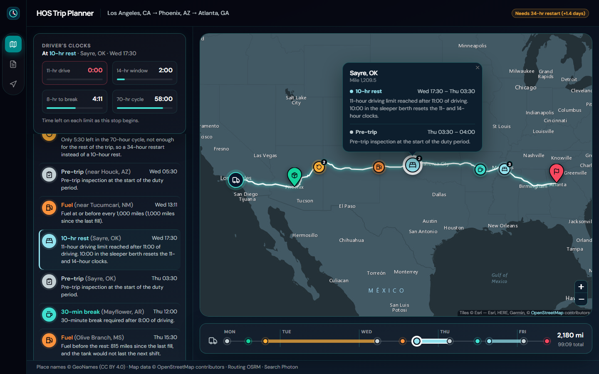
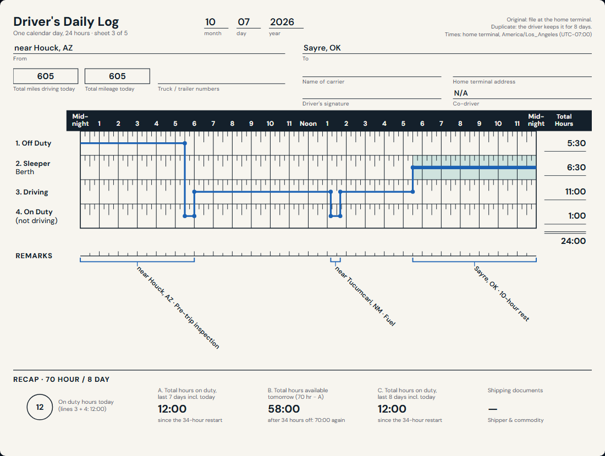

# HOS Trip Planner

[](https://github.com/Mishallic/hos-trip-planner/actions/workflows/ci.yml)

Plan a truck trip from the driver's current location, through the pickup, to the
drop-off. The planner places every stop the FMCSA hours-of-service rules require
(property-carrying driver, 70 hours / 8 days) and fills in the driver's daily log
sheets for every day of the trip.

**Live:** [hos-trip-planner-web.vercel.app](https://hos-trip-planner-web.vercel.app)





## What it does

**Inputs:** current location, pickup, drop-off, and the hours already used in the
70-hour cycle. Optional: start date and time (default now), the home terminal's time
zone, and the log header fields (driver, carrier, truck, trailer, shipper, commodity,
load number, home terminal). All inputs live in the URL, so a plan is a shareable link.

**Outputs:**
- **Route map** with the route and every stop: pre-trip inspections, pickup and
  drop-off, fuel, 30-minute breaks, 10-hour rests and 34-hour restarts.
- **Stop list** with the rule behind each stop ("11-hour driving limit reached after
  11:00 of driving").
- **Timeline** spaced by time, so a 34-hour restart reads as long.
- **Driver's clocks** (11-hour drive, 14-hour window, 8-hour break, 70-hour cycle)
  at any stop. The map, list, timeline and clocks share one selected stop.
- **Daily log sheets** drawn like the paper form (guide p. 15-19): header, the
  24-hour grid with the duty line at exact minutes, line totals adding to 24:00,
  remarks with a bracket and a 45° flag at every stop, and the 70-hour recap. One tab
  per day; "Print all days" gives one landscape page per day.
- **Turn-by-turn directions** with the stops in the order the driver reaches them.

## How the planner works

The engine (`backend/planner/domain/hos_engine.py`) is pure Python: no Django, no
HTTP, nothing outside the standard library (a test enforces this). Times are whole
minutes from the trip start; positions are miles along the route.

1. Drive as far as every clock allows: the 11-hour limit, the 14-hour window, the
   8-hour break rule, the 70-hour cycle, and the next fuel stop (at or before every
   1,000 miles).
2. Insert the stop the binding limit requires: a break, a 10-hour rest in the sleeper
   berth, a 34-hour restart, or fuel. Each stop records the limit that caused it.
3. Repeat until the drop-off. Pickup and drop-off are 1 hour on duty; every duty
   period that includes driving starts with a 30-minute pre-trip inspection.

The result is one timeline of events. Everything else is a view of it: the stops, the
clocks at each stop, and the daily logs (`log_builder.py`), which split the timeline
at midnight in the home terminal's time zone. The frontend draws; it contains no HOS
logic.

Every limit and assumption is in one `HOSPolicy` object
(`backend/planner/domain/policy.py`). Where the rules leave room, the planner's
choices are listed below as D1-D19, and the code and tests cite them.

## Hours-of-service rules

The planner follows the FMCSA rules for a property-carrying driver on the
70-hour / 8-day schedule, as described in the FMCSA *Interstate Truck Driver's
Guide to Hours of Service* (April 2022). Code and tests cite it as "guide p. N".

| Rule | Limit | Guide |
|---|---|---|
| Driving limit | 11 hours of driving after 10 hours off duty | p. 6 |
| Driving window | no driving after the 14th hour since coming on duty | p. 6 |
| Break | 30 consecutive minutes off the wheel after 8 hours of cumulative driving | p. 10 |
| Cycle | no driving after 70 hours on duty in 8 days | p. 10-11 |
| Restart | 34 consecutive hours off duty resets the cycle | p. 11 |

### Planning decisions

Where the rules leave room, or the inputs don't say, the planner makes these
choices. Code and tests cite them as D1, D2, ...

| # | Decision |
|---|---|
| D1 | The trip has a start date and time, defaulting to now. Log sheets run midnight to midnight. |
| D2 | The whole trip uses one time zone: the home terminal's, which defaults to the current location's (guide p. 16). |
| D3 | Cycle hours used apply to the whole trip; there is no day-by-day history. Reaching 70 hours triggers a 34-hour restart. |
| D4 | A 30-minute pre-trip inspection, on duty, starts each duty period that includes driving: at the trip start and after every 10-hour rest or 34-hour restart. When the period starts at the pickup, the inspection comes before loading. It is per duty period, not per calendar day. No separate post-trip inspection is planned. |
| D5 | The 10-hour rest is logged in the sleeper berth. The 30-minute break is logged off duty. |
| D6 | The split sleeper-berth provision (guide p. 7-9) is not used. |
| D7 | A 30-minute fuel stop, on duty, comes at or before every 1,000 miles. The tank is full at the start. |
| D8 | Driving time is never planned faster than a 55 mph average, because free routers estimate car speeds. |
| D9 | Any 30 consecutive non-driving minutes count as the break, including fuel stops and pickup (guide p. 10). |
| D10 | The driver starts the trip rested, with full 11- and 14-hour clocks. The log shows off duty before the start and after drop-off. |
| D11 | The 34-hour restart is logged off duty. |
| D12 | The recap is approximate: it adds this trip's on-duty time to the cycle hours entered, because earlier days are unknown. |
| D13 | Pickup and drop-off each take 1 hour, on duty. |
| D14 | On-duty work is still allowed after the 14-hour window or the 70-hour cycle runs out; only driving stops (guide p. 6, 9-10). |
| D15 | When a break comes due and the next fuel stop would be due within the next hour of driving, the driver fuels then instead. The fuel stop counts as the break (D9), so there is one stop, not two. |
| D16 | The driver fuels just before a 10-hour rest or 34-hour restart when the trip needs more fuel and the tank won't last the next full shift. Only when that adds no fuel stop to the rest of the trip, and the road stop it replaces would not have doubled as the next shift's 30-minute break (D9). So it never adds a stop or lengthens the trip, and fuel still comes at or before every 1,000 miles. |
| D17 | Log sheets use the home terminal's UTC offset at the trip start for the whole trip, so every sheet is exactly 24 hours, with no 23- or 25-hour days at a daylight-saving change. |
| D18 | Remarks name each stop after the nearest place with at least 1,000 people, as "City, ST" (guide p. 17). When that place is more than 5 miles away the remark reads "near City, ST". The lookup is offline, so planning never waits on a geocoding service. |
| D19 | When a 10-hour rest comes due and the 70-hour cycle can't cover the rest of the trip, the driver may take the 34-hour restart in its place: the same driving, 10 hours sooner. The planner plans the trip three ways (restart early only when keeping the hours left would not save a restart; only when one restart covers the rest; never early) and keeps the plan with the fewest restarts, then the earliest drop-off. It never takes more restarts or arrives later than restarting at every rest would. |

## Architecture

```
React (Vite, TypeScript, MUI) --/api--> Django REST API --> planning service
                                                              |-- HOS engine + log builder (pure)
                                                              `-- providers: places, routing, stop names, time zones (cached)
```

```
backend/planner/
  domain/      HOSPolicy, models, hos_engine, log_builder, clocks, explain, geometry (pure)
  providers/   OSRM routing, Photon + Nominatim search, offline stop names and time zones, cache
  services/    trip_planning.py: the only place that wires providers, engine and logs
  api/         serializers, views, JSON errors, throttling
  tests/       one test class per rule, property tests, golden trips, API tests
frontend/src/
  features/    trip-form, route-map, itinerary, trip-summary, eld-log, logs, directions, plan
  state/       URL state, the plan query, the shared stop selection
  lib/         formatting, time scale, polyline
```

## API

| Endpoint | Returns |
|---|---|
| `GET /api/health` | `{"status": "ok", "python": "<version>"}` |
| `POST /api/trips/plan` | The plan: summary, stops, timeline with clocks, route (encoded polyline and turn-by-turn steps), daily logs, log header |
| `GET /api/places?q=` | Place suggestions in the US, Canada and Mexico |

Example request:

```json
POST /api/trips/plan
{"current": {"query": "Los Angeles, CA"}, "pickup": {"query": "Phoenix, AZ"},
 "dropoff": {"query": "Atlanta, GA"}, "cycle_used_hours": 52,
 "start_time": "2026-10-05T07:00", "home_tz": "America/Los_Angeles"}
```

Errors are always JSON, `{"error": {"code", "message", "field"?, "fields"?}}`:
400 for invalid fields, 422 when a place is not found or no road connects the stops,
429 when throttled (20 plans and 120 searches a minute), 503 when a map service is
down, 500 for anything unexpected. Every plan response carries a `Server-Timing`
header (`geocode`, `route`, `compute`, `total`, in ms), visible in the browser's
network panel.

## Tests

Backend (294 tests), from `backend`:

```powershell
.\.venv\Scripts\python.exe -m pytest
```

Frontend (103 tests), from `frontend`:

```powershell
npm test
```

- **Rules:** one test class per rule and decision, each citing the guide page or D-number.
- **Property tests (Hypothesis):** random trips never break a rule (an independent
  checker in `tests/hos_helpers.py`), planning is deterministic, and the restart rule
  never adds a restart or arrives later than the rule it replaced.
- **Golden trips:** four real routes, replayed from recorded map responses and compared
  with snapshots end to end.
- **Frontend:** the log sheet's geometry (the duty line is continuous, covers 0-1440,
  and each row is as long as its total, including the guide's John Doe day on p. 18),
  the time scale, the shared selection, directions.
- **CI** (GitHub Actions) runs ruff, pytest, lint, unit tests, the type check and the
  build on every push.

## Limits

- **The recap is approximate** (D12): the days before the trip are known only as the
  cycle hours entered, so the recap's A (last 7 days) and C (last 8 days) come out equal.
- **No post-trip inspection** is planned (D4), and the split sleeper-berth provision is
  not used (D6).
- **US, Canada and Mexico only**, for place search and routing.
- **Free map services:** routing uses the public OSRM demo server and search uses
  Photon, both rate-limited. Results are cached, and the API throttles requests.
- **Cache and throttle are per instance** and best effort: each serverless instance
  keeps its own, with no shared store.
- **Very long trips** (6,000+ miles) take about 1.5 s on the server; 1.2 s of that is
  computing, mostly reading the route's geometry.

## What is deliberately left out

- **No database:** nothing needs storing. A plan is computed from its inputs, and the
  inputs live in the URL.
- **No Redis:** the per-instance cache and throttle are enough for one small deployment.
- **No Redux:** server state is TanStack Query, form state is the URL, and the one
  piece of shared UI state (the selected stop) is a small reducer.

## Data and services

- Routing: [OSRM](https://project-osrm.org) public demo server.
- Place search: [Photon](https://photon.komoot.io) by komoot, with [Nominatim](https://nominatim.org) as a fallback. Map data © [OpenStreetMap](https://www.openstreetmap.org/copyright) contributors.
- Stop names: place data from [GeoNames](https://www.geonames.org), licensed under [CC BY 4.0](https://creativecommons.org/licenses/by/4.0/). `backend/scripts/build_places.py` builds the bundled file (`places_us_ca_mx.tsv.gz`) from GeoNames `cities1000`, keeping places in the US, Canada and Mexico with at least 1,000 people.
- Time zones: [timezonefinder](https://github.com/jannikmi/timezonefinder), offline.
- Map tiles: [Esri](https://www.esri.com) World Dark Gray Canvas (Esri, HERE, Garmin, © OpenStreetMap contributors), no key needed.

## Run locally

Requires Python 3.14 and Node 20.19+ (CI uses Node 24).

### API

```powershell
cd backend
py -3.14 -m venv .venv
.\.venv\Scripts\python.exe -m pip install -r requirements-dev.txt
.\.venv\Scripts\python.exe manage.py runserver
```

The API listens on http://127.0.0.1:8000.

### Web

```powershell
cd frontend
npm install
npm run dev
```

The web app listens on http://localhost:5173 and proxies `/api` to the local API.

## Deploy

Both apps deploy to Vercel as two projects from this repository.

| Project | Root directory | Notes |
|---|---|---|
| `hos-trip-planner-api` | `backend` | Detected as Django. Set `DJANGO_SECRET_KEY`. Python version comes from `.python-version`. `vercel.json` runs the function in Frankfurt (`fra1`), next to the OSRM and Photon servers. |
| `hos-trip-planner-web` | `frontend` | Detected as Vite. `vercel.json` rewrites `/api/*` to the API project, so the browser only talks to one origin and no CORS is needed. |
